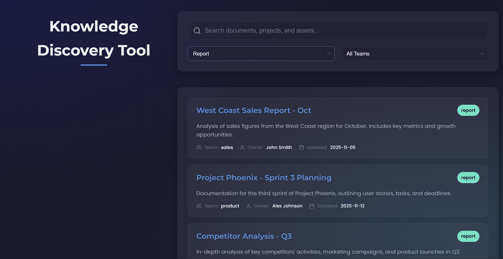

# 🚀 Knowledge Discovery & Internal Search Tool

A smart internal search tool built for the MarTech competition. This application indexes marketing documents and assets, delivers fast, relevant results, and helps teams find information instantly.

**Competition Submission for Ashutosh Yadav**

### [➡️ View the Live Demo Here]
(https://ashutosh9569.github.io/knowledge-search-tool/)

---

## 📸 Application Preview

---

## 🎯 The Problem

Marketing teams generate massive amounts of documents, but finding the right file becomes challenging as content is scattered. This leads to wasted time, duplicated work, and inconsistent messaging.

## ✨ The Solution

This tool is a clean, fast, and intelligent UI that acts as a central hub for all internal assets. It allows users to:
* **Search Instantly:** Results are filtered as you type.
* **Filter by Category:** Narrow results by "Report," "Presentation," "Asset," or "Guide."
* **Filter by Team:** Find assets belonging to "Marketing," "Sales," or "Product."
* **Access Files Directly:** Each result links directly to the file.

---

## 🛠️ Key Decisions & Technical Approach

### 1. Technology Stack: `HTML` | `CSS` | `JavaScript` (No Frameworks)
* **Approach:** I intentionally chose to build this as a "vanilla" project without any frameworks (like React or Vue) or build steps.
* **Decision:** This ensures the application is extremely lightweight, has zero dependencies, and can be deployed instantly on any static host (like GitHub Pages). It's a pure, self-contained solution.

### 2. UI/UX: Dark Mode & Glassmorphism
* **Approach:** To stand out in a competition of 2,000 people, a standard "white-page" design wouldn't be enough.
* **Decision:** I implemented a sleek, modern, dark-mode UI with "glassmorphism" (frosted glass) effects. This not-only looks professional but also improves accessibility in low-light environments and creates a clear visual hierarchy.

### 3. "Smart" Search Logic (JavaScript)
* **Approach:** A simple search that only checks the title is not very useful.
* **Decision:** The search function (`performSearch` in `app.js`) queries *both* the document's **title** and its **snippet/description**. This provides more relevant, context-aware results, mimicking a true internal search engine.

### 4. Asynchronous UI (Event Listeners)
* **Approach:** The requirement was for "quick access."
* **Decision:** I bound the search function to the `input` event on the search bar (not a "submit" button). This means the UI updates instantly with every keystroke, providing the fastest possible access to information.

---

## 🔧 Challenges Faced

* **Dropdown Visibility:** A key challenge was that in dark mode, the browser's default `<option>` list for the dropdowns had light text on a light background, making it invisible.
* **Solution:** I fixed this by adding a specific CSS rule (`.filters select option { color: #000; }`) to force the *options* themselves to render with dark text, ensuring readability while maintaining the dark theme for the main UI.

## 🏃 How to Run Locally

1.  Clone this repository: `git clone [YOUR-REPO-URL]`
2.  Navigate to the folder: `cd [YOUR-REPO-NAME]`
3.  Open the `index.html` file in any modern web browser.
